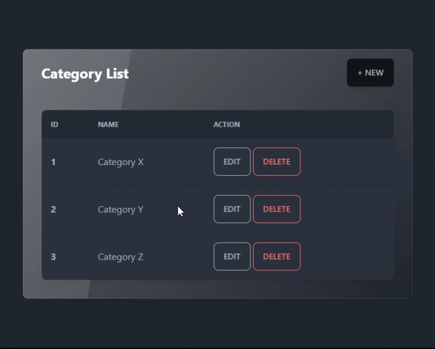

#### VanillaJS Front End

> Example of consuming the API with VanillaJS

Example of consuming category endpoints with VanillaJS, allowing to create, list, update and delete categories.

##### Instructions

Just open any html file directly in the browser with the API running.

##### demo

